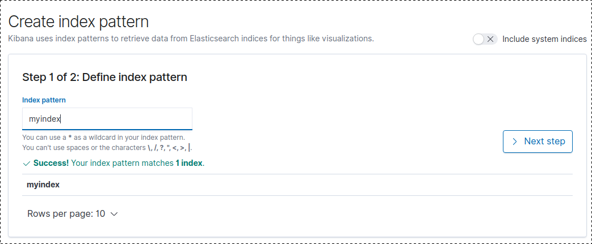
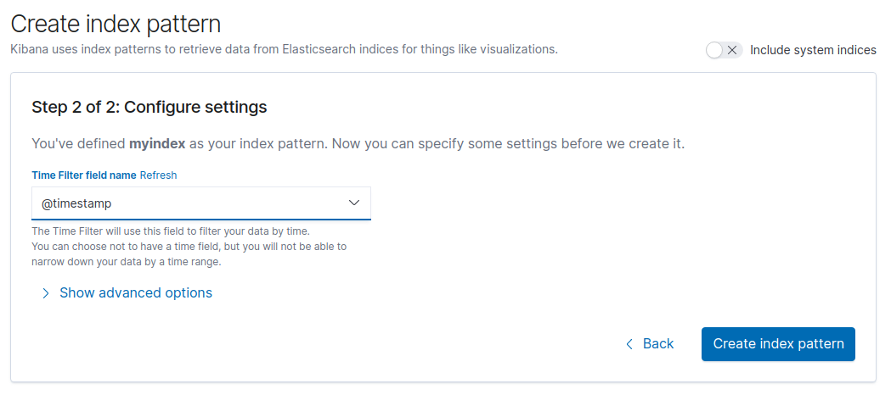
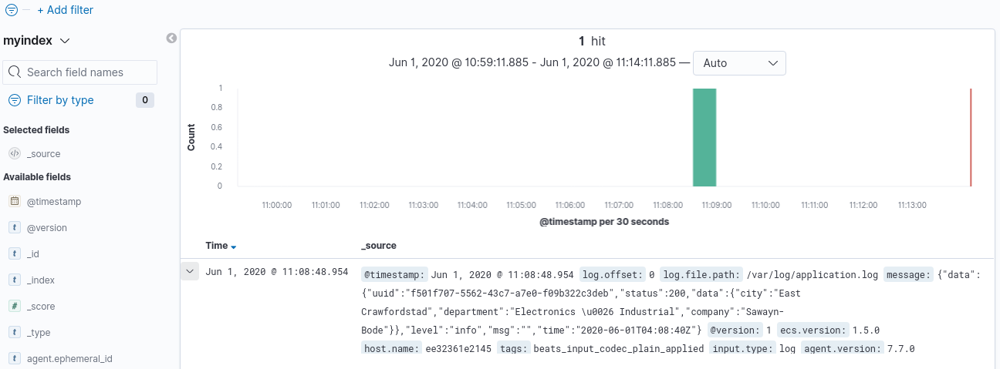
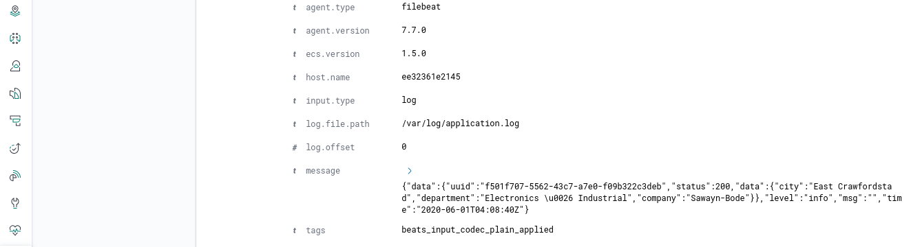

# Go ELK Logging
Demonstrate how to ship logs using Filebeat to ELK Stack 7.7

## In order to use this repo you need
- Increase virtual memory to 262144 in host OS
**sudo sysctl -w vm.max_map_count=262144**

- Port 5044, 5601, 8080, 9200
- Docker

## Getting Started

 1. Clone [https://github.com/dimaspriyo/go-elk-logging](https://github.com/dimaspriyo/go-elk-logging)
 2. Run **docker-compose up -d**
 3. Check deployed container status 
 **docker ps**
 4. Hit golang services to write some ramdom logs using
 **curl localhost:8080/trigger**
 5. Create index pattern in Kibana  ->  Discover
  **localhost:5601**
  
  
  
  
 6.  Check our application log in Kibana -> Discover
 
 
 
 
 
 ## Reference Link
 https://github.com/deviantony/docker-elk
